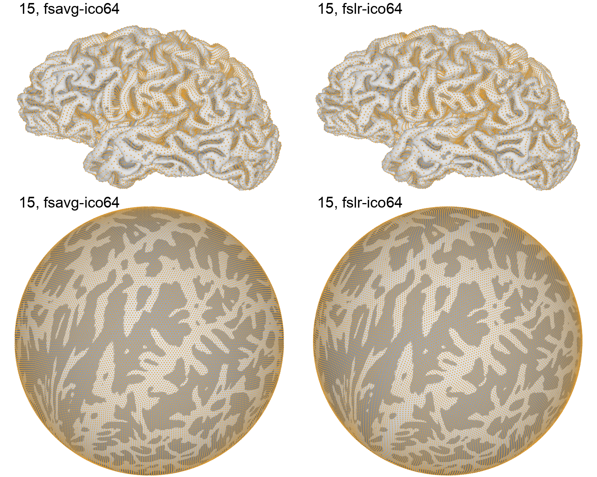
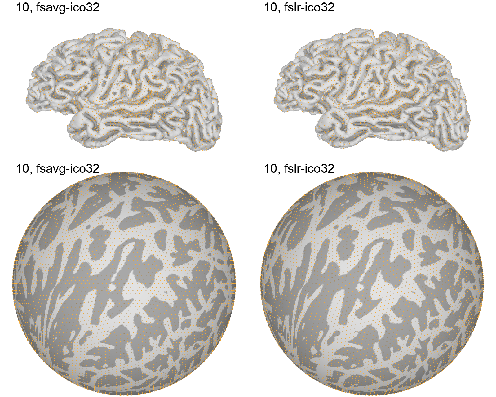
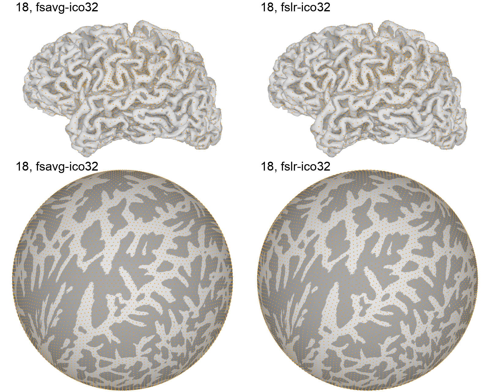

# Vertex distribution on the cortex

This page shows the distribution of cortical vertices on a group of 15 test participants ([StudyForrest](https://www.studyforrest.org/) data).

The images below are animated PNGs, and they will automatically flip back and forth between traditional template space (fsavg/fslr) and the `onavg` template space, to emphasize the differences between template spaces.

This page is mainly for demonstration purposes, see the [inter-vertex distance page](inter-vertex_distance) for quantitative analyses.

## ico64 resolution

Click subject IDs below to see the vertex distribution on each test participant's cortical surface.

:::{margin}
Notably, with the `onavg` surface template, the vertices are more evenly distributed throughout the cortex on the anatomical surface ("midthickness", top row) than fsavg/fslr templates, and less evenly distributed on the spherical surface (bottom row).
:::

````{tab-set}
:class: dropdown
```{tab-item} sub-01

```
```{tab-item} sub-02

```
```{tab-item} sub-03

```
```{tab-item} sub-04

```
```{tab-item} sub-05

```
```{tab-item} sub-06

```
```{tab-item} sub-09

```
```{tab-item} sub-10

```
```{tab-item} sub-14

```
```{tab-item} sub-15

```
```{tab-item} sub-16

```
```{tab-item} sub-17

```
```{tab-item} sub-18

```
```{tab-item} sub-19

```
```{tab-item} sub-20

```
````

## ico32 resolution

Click subject IDs below to see the vertex distribution on each test participant's cortical surface.

````{tab-set}
:class: dropdown
```{tab-item} sub-01

```
```{tab-item} sub-02

```
```{tab-item} sub-03

```
```{tab-item} sub-04

```
```{tab-item} sub-05

```
```{tab-item} sub-06

```
```{tab-item} sub-09

```
```{tab-item} sub-10

```
```{tab-item} sub-14

```
```{tab-item} sub-15

```
```{tab-item} sub-16

```
```{tab-item} sub-17

```
```{tab-item} sub-18

```
```{tab-item} sub-19

```
```{tab-item} sub-20

```
````
